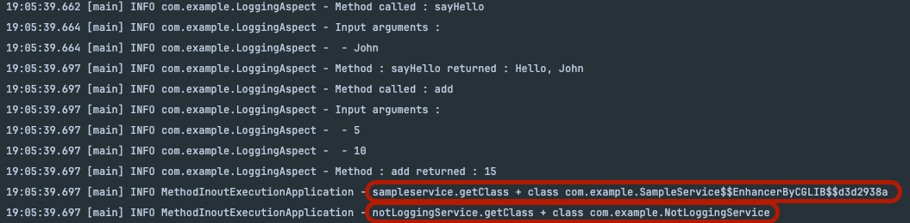

# 정리
커스텀 어노테이션이 지정되지 않은 클래스는 Proxy(CGLIB) 클래스가 생성되지 않는다.

SampleService에는 메서드 입출력 로깅하는 커스텀 어노테이션 추가 NotLoggingService에는 어노테이션 없음  

어노테이션이 없는 메서드는 프록시 클래스로 생성하지 않는 것으로 확인  
단, 클래스내에 커스텀 어노테이션이 하나라도 있다면 해당 클래스는 프록시 클래스로 생성